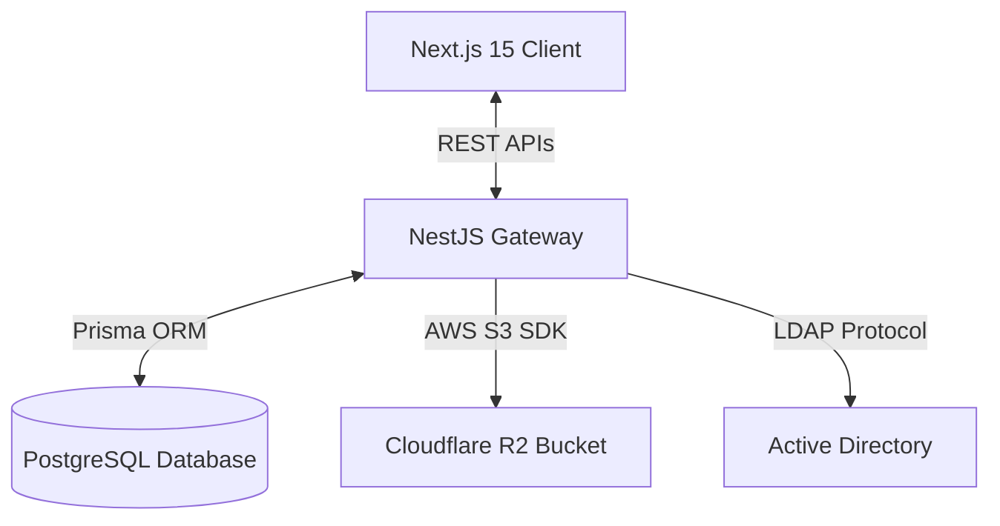

# Petty Cash Manager (Kas Kecil)

[](https://nestjs.com/)
[](https://nextjs.org/)
[](https://www.prisma.io/)
[](https://www.postgresql.org/)
[](https://www.cloudflare.com/products/r2/)

A secure, multi-warehouse petty cash journal and monthly budgeting platform designed for enterprise branch expense auditing, receipt storage, and Active Directory verification.

---

## 💼 Business Value & Real-World Impact

In organizations with multiple distributed warehouses or branches, auditing petty cash (reimbursements, office supplies, transport, minor maintenance) is prone to leaks, missing receipts, and budget overruns. **Petty Cash Manager** optimizes branch finance control by:
* **Branch-Level Cash Isolation**: Scopes transactions (`FlowLog`) and cash flows strictly to specific warehouses, ensuring cashiers only access their respective branch journals.
* **Proactive Budgeting Safeguards**: Limits monthly expenses against admin-defined limits (`Budget` thresholds) per expense category, preventing unapproved overspending.
* **Digital Receipt Archival**: Cashiers upload expense attachments directly to Cloudflare R2 object storage during transaction logging, creating an immutable audit trail.
* **Enterprise Identity Management**: Authenticates corporate staff using local Active Directory (LDAP) configurations, mapping roles automatically (Cashier, Supervisor, Admin).

---

## 🛠️ Tech Stack & Architecture



### Backend
* **NestJS (V10)**: Strict modular architectural framework.
* **Prisma ORM & PostgreSQL**: Structured transactional storage with relational integrity.
* **LDAP JS Client**: Corporate authentication sync.
* **Winston (nest-winston)**: Log rotation and debugging trails.
* **AWS SDK (S3 client)**: Integration with Cloudflare R2 for storing receipt image files.

### Frontend
* **Next.js 15**: Fast web framework using React 19 and Turbopack.
* **Radix UI Themes**: Standardized, clean, accessible interface library.
* **Recharts**: Dynamic visual charts representing category-wise budget vs actual spending metrics.
* **React Hook Form & Zod**: Schema-based client-side form validation.

---

## 🚀 Key Features

### 1. Multi-Warehouse Budgeting Engine
Admins allocate budgets per category:
* **Replenishment (`IN`)**: Logs incoming petty cash funds.
* **Expenses (`OUT`)**: Logs payouts categorized under items like "Transport" or "Office Consumables".
* **Monthly Budget Cap**: `Budget` schema limits spending by checking current category accumulation against designated limits for `month` and `year`.

### 2. Digital Receipt Storage
Supports dual attachment pipelines:
* **Cloudflare R2 Integration**: Direct S3 client connection for fast storage uploads.
* **Fallback Webhook**: Integrates with workflow triggers (e.g., n8n) for automated receipt parsing or document management.

### 3. Role-Based Access Control (RBAC)
* **KASIR (Cashier)**: Creates branch specific `FlowLog` records. Can view their own warehouse registers.
* **SUPERVISION (Supervisor)**: Reviews transactions and monitors budget utilization charts.
* **ADMIN / IT**: Modifies global AD settings, defines warehouses, maps users, and alters budget allocations.

---

## ⚙️ Local Development Setup

### Backend Setup
1. Navigate to the backend directory:
   ```bash
   cd backend-nest
   ```
2. Copy the environment template:
   ```bash
   cp .env.example .env
   ```
3. Install dependencies:
   ```bash
   pnpm install
   ```
4. Run migrations and start NestJS:
   ```bash
   npx prisma migrate dev
   pnpm run dev
   ```

### Frontend Setup
1. Navigate to the frontend directory:
   ```bash
   cd ../frontend
   ```
2. Copy the environment template:
   ```bash
   cp .env.example .env.local
   ```
3. Install dependencies:
   ```bash
   pnpm install
   ```
4. Start Next.js development server:
   ```bash
   pnpm run dev
   ```
